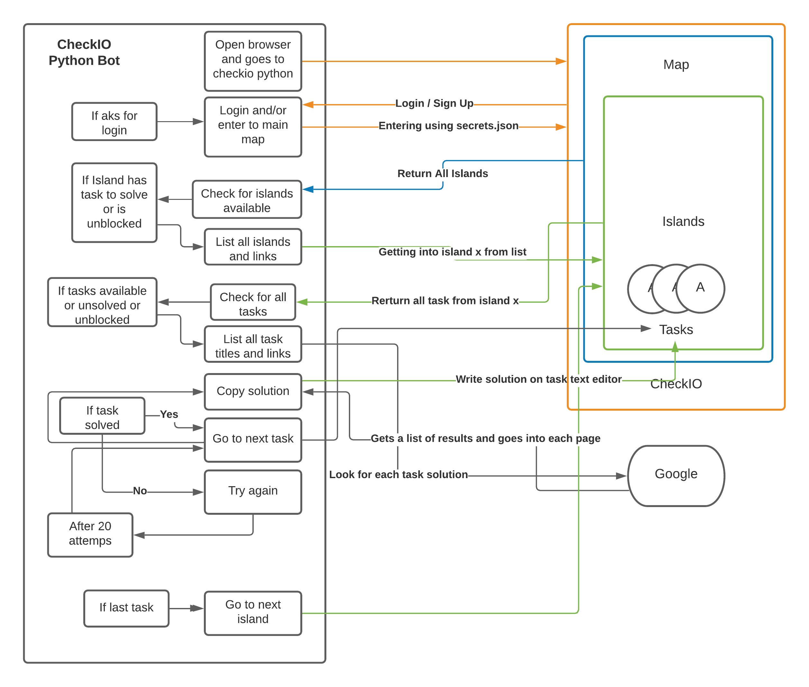

# CheckIO Python Agent

 This is an organization that create code challenges for the ones who are learning python or javascript and want to get better on the quality of their code and train their logic as a game.

The objective of the game is to cover all the islands, on every island there are a sort of tasks available (some are for paid users) or some are blocked cause you haven't solve some tasks before.

 Map of CheckIO Python

## Agent Diagram
This system is called an agent and it's architecture is based on *Simple reflex agents* type


## Instalation
  - Requierements:
    - Google Chrome
    - Stable internet conection
    
- First Create an account on [Checkio.org](https://checkio.org/) and solve the first task

### Create secrets.json file
Example `secrets.json`
```json
{
  "username": "exampleusername",
  "password": "myP@ssword123"
}
```

### Setup Python Virtual Environment
```buildoutcfg
python3 -m venv venv
. /venv/Scripts/Activate.ps1"
pip3 install -r requirements.txt
```

### Run Script
```buildoutcfg
python3 checkio.py
```


## Logic Behind
Objective:
- Level up de account.
        This is done by doing the tasks

How to?
- Checking existing solutions on google. (First Attempt)

Steps:

    1. Open browser, and go to checkio home page (Logged in home page or map)
    2. Get info about all islands links.
    3. Go on the link from X island.
    4. Get all info about all the tasks from current island. (Titles, links, unlocked [Free account] or solved)
    5. Click on the task and copy the title or description.
    6. Go find the solution on the internet.
    7. Go to the task url + /solve/ + paste solution
    8. Click on check
    9. If task solved or not solved:
        9.1. Task solved - Move on the next task (repeat algorithm)
        9.2. Task not solved - Go to instruction 5 again (5 tries MAX, then skip)

    10. Move to the next island if task are skipped or solved
    
    
*Note: For this to actually work fine is needed a lot undersantanding of error handling*
