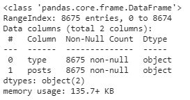
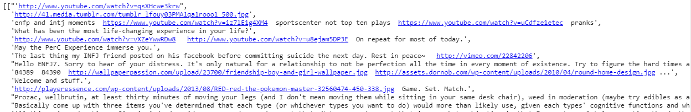
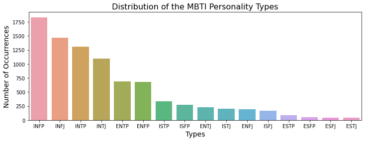
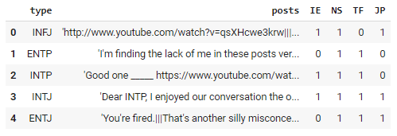
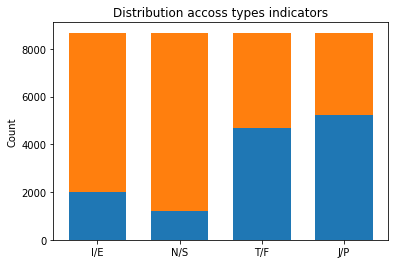
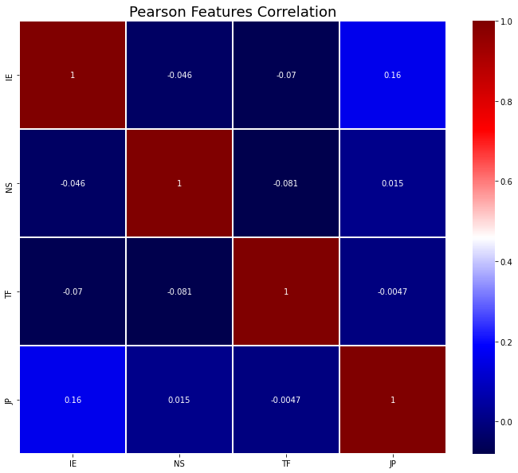
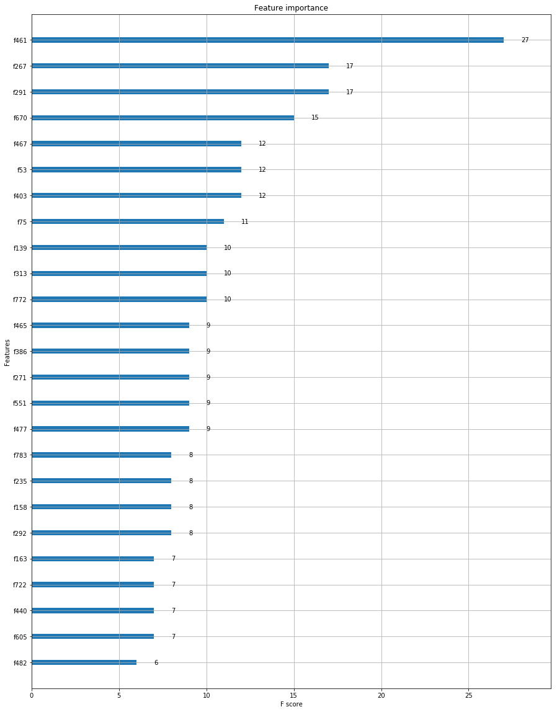
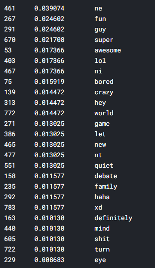

# Myers-Briggs Personality Type

The purpose of this project is to help the human resources department of Comfenalco at the moment of the hiring process to predict what kind types of personalities on the Myers Briggs a person will present based on the social text posts and comments.The data used to train the algorithm in english is from a public dataset that took twitter posts and comments and have those identified on one of the 16 types.

### So what's the MYBTY?
The Myers-Briggs Personality Type Indicator is a self-report inventory designed to identify a person's personality type, strengths, and preferences. The questionnaire was developed by Isabel Myers and her mother Katherine Briggs based on their work with Carl Jung's theory of personality types.

## Kernel
- Data Exploring
- Exploring as Natural Language Processing using NLTK
- Aplying XGBoost using steps from "[XGBoost With Python Mini-Course](https://machinelearningmastery.com/xgboost-python-mini-course/)".
- Trying out to build a model for each type indicator individually (each of the four leters).
- And finally, predicting a Myers-Briggs Personality Type using a list of posts.

### Outline

1. Data preview - distribution and correlation.
2. Data preparation - process posts, vectorize with count and tf-idf.
3. Apply steps of the "[XGBoost With Python Mini-Course](https://machinelearningmastery.com/xgboost-python-mini-course/)".
4. Predict own Myers-Briggs Personality Type base on a few tweets and blog post.

## Process Flow
### 1. Data Exploration
We look for the data info and then we check how does the posts look like, also the rows.

Now we check for the distribution to see how the data develops, after that we get the doomies for each letter so we get the values per indicator.

### 2. Trying to find a linear relation
Using pearson correlation matrix we achieve an attemp but failed on the process.

### 3. Using another method to prepare the data
For the data preprocessing steps are:
1. Binarize Type Indicator
2. Remove urls
3. Keep only words and put everything lowercase
4. Lemmatize each word
5. Remove MBTI profiles strings. (Appear in the posts)
6. Vectorize with count and tf-idf (Keep words appearing in 10% to 70 % of the posts)

### 4. Training ML Model
Train XGBoost classifiers
[1] https://machinelearningmastery.com/xgboost-python-mini-course/
*Inputs*
X / Y data
X: Posts in tf-idf representation
Y: Binarized MBTI

Here we are trying to make a model for each indicator so every letter is predicted well.

### 5. Improve Performance
  ##### Feature Importance with XGBoost
"A benefit of using ensembles of decision tree methods like gradient boosting is that they can automatically provide estimates of feature importance from a trained predictive model. A trained XGBoost model automatically calculates feature importance on your predictive modeling problem." [[1]](https://machinelearningmastery.com/xgboost-python-mini-course/)*

Importance Plot

Meaning of featur code

  ##### How to Configure Gradient Boosting

  *"A number of configuration heuristics were published in the original gradient boosting papers. 
  They can be summarized as:*

  - *Learning rate or shrinkage (learning_rate in XGBoost) should be set to 0.1 or lower, and smaller values will require the addition of more trees.*
  - *The depth of trees (tree_depth in XGBoost) should be configured in the range of 2-to-8, where not much benefit is seen with deeper trees.*
  - *Row sampling (subsample in XGBoost) should be configured in the range of 30% to 80% of the training dataset, and compared to a value of 100% for no sampling." [[1]](https://machinelearningmastery.com/xgboost-python-mini-course/)*

  See also [Complete Guide to Parameter Tuning in XGBoost](https://www.analyticsvidhya.com/blog/2016/03/complete-guide-parameter-tuning-xgboost-with-codes-python/)

###

